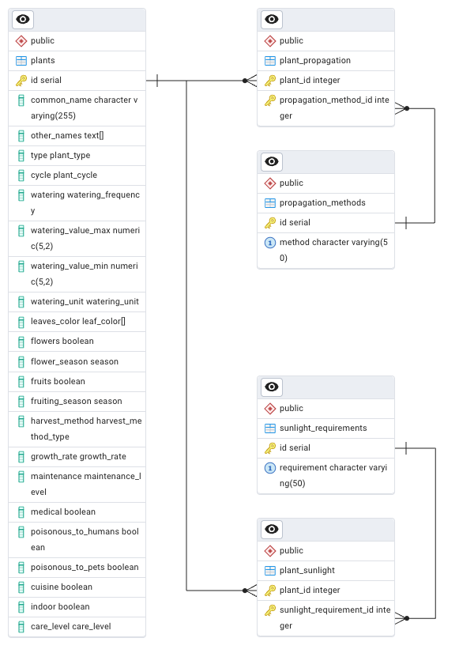

# Folium-Backend

## Description
---

This project is a backend API developed to feed an application that helps
users to take care of their plants. Providing multiple information about it.

## Objectives
---

**The goals are:**
- Create required endpoints to feed ***Folium Application***.
- Containerize the application.
- Add database with plants information.

**Not required goals:**
- Add API standard documentation.
- Develop a CRUD API application.

## Local installation
---

### Run Database

**Requirements**

- To have docker installed.
- A database administration UI is helpful.

**Steps**

1. Start docker machine if it is off.
2. Have the following environment variables in root path `.env`.
    - APPLICATION_NAME
    - POSTGRES_USER
    - POSTGRES_PASSWORD
    - POSTGRES_DB
    - POSTGRES_PORT
3. Run
    ```Terminal
    docker-compose up
    ```
    To run a container with the database.

## Documentation
---

### Database

#### Entity Relationship Diagram


